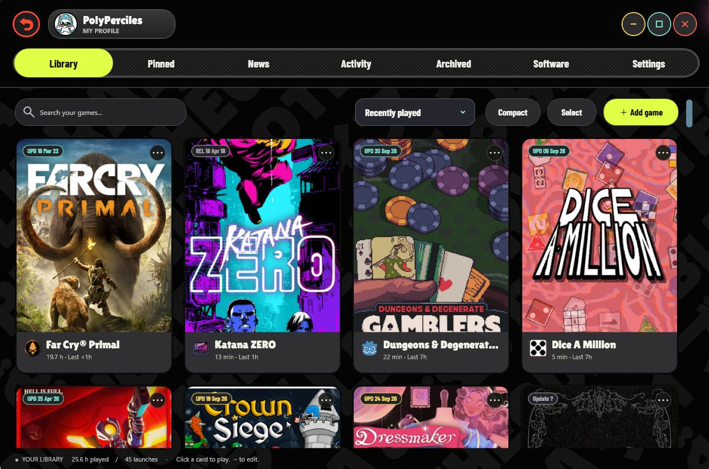
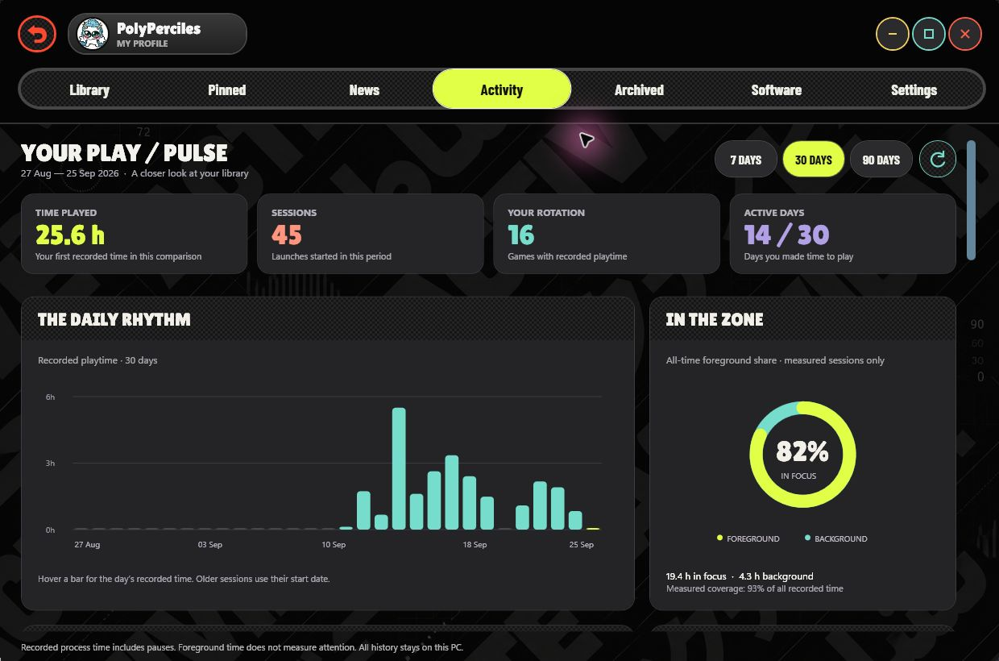
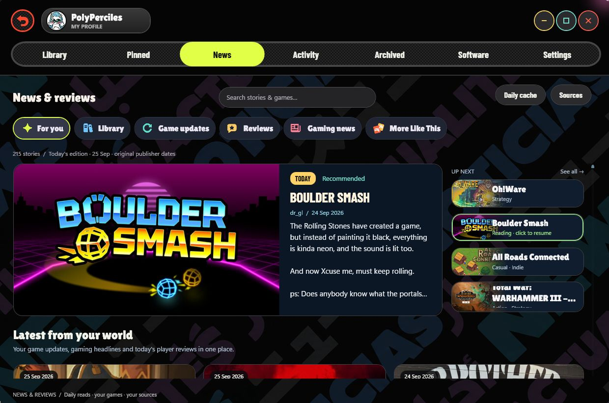

<h2 align="center">Your collection should make you want to play.</h2>

Bold covers. One-click launching. A history worth keeping. <b>A personal Windows game launcher that gets out of the way when the game begins.</b>

<a href="#see-your-next-session">See it in action</a> · <a href="#the-whole-deck">Every feature</a> · <a href="#install-in-four-steps">Get started</a> · <a href="https://github.com/DopaLab/playdeck/issues">Report an issue</a>

> **No Playdeck account. Local library and history. No always-running launcher.**
> Add the games you choose, give them a beautiful home, and launch. A separate optional helper records the session and exits afterward.

## See your next session

Real installed Playdeck 7.0.7. The creator’s own library, profile and recorded activity—not demonstration data.

<table>
<tr><td width="50%"><h3>🟡 A shelf, with personality</h3>Cover-first cards, a manually ordered Pinned shelf, expressive upright typography and dark illustrated backgrounds. Your games are the point of the interface.</td><td width="50%"><h3>🟢 One click to the good part</h3>Click a card to play. Three dots to edit. Playdeck closes after a successful game launch. Utilities have a separate shelf and keep the launcher open.</td></tr>
<tr><td><h3>🟣 A collection with a memory</h3>First played, last played, focus time, session history and your journey through a game. Archive its story even after its installation is gone.</td><td><h3>🟠 A reason to come back</h3>Library news, patch notes, daily player reviews and related-game discovery. Cached editions keep browsing quiet between daily refreshes.</td></tr>
</table>

## Your playtime tells a story

**Your Play / Pulse** brings together 7-, 30- and 90-day views, daily bars, active days, game rankings, a play calendar and foreground/background time. **Your Journey** adds first and last launch dates, elapsed calendar time and an optional completion marker. Export sessions to CSV to explore the numbers yourself.

The archive is a museum: clicking an archived card opens its journey. It does not try to start a missing executable, scan an uninstalled game or discard your history.

## Stay close to the games you care about

| Channel | What you get |
|:--|:--|
| **For you** | A daily mix of player reviews, publisher updates and gaming headlines. |
| **Library** | News for matched games in your collection; optionally include archived games. |
| **Game updates** | Patch and update posts, with links to the original details. |
| **Reviews** | Player perspectives on games to discover, with attribution and recommendations. |
| **Gaming news** | Choose built-in RSS publications or add your own feed. |
| **More Like This** | Games Steam relates to matched library titles, with artwork, descriptions, the connection and a store link. |

Reviews rotate automatically. Hover or focus to pause; select a queued review to hold it for reading. Click the main review to expand the text. Stories open in your default browser; small game icons on update cards open the game’s store page.

Saved stories appear first. Daily editions follow your **local calendar day**, with cached artwork and bounded requests. Publisher dates remain the publisher’s dates. Steam Spotlight has been removed.

## Why choose Playdeck?

For players with games across local folders and storefronts, Playdeck brings together a distinctive cover-first interface, direct launching, personal history and daily discovery in one native Windows app.

| What matters | The Playdeck approach |
|:--|:--|
| **Start playing quickly** | Direct card launching, Explorer integration and a dedicated favorites shelf. |
| **Stay in control** | Add what you choose. No broad folder crawler filling the library with helper executables. |
| **Keep the visual identity** | Bold typography, cached covers, designed fallbacks and coordinated dark backgrounds. |
| **Do less background work** | Native WPF, virtualized grids, reused decoded artwork, indexed history and cached online results. |
| **Remember games after uninstalling** | Archived artwork, icons and activity survive independently of game files. |
| **Keep your data yours** | Local storage, no Playdeck sign-in, no telemetry and no cloud library upload. |

That combination is the reason to try it—not an untested claim of superiority over every launcher, game or PC.

## The whole deck

<b>01 / Library, artwork & personal style</b>

- Add executables and shortcuts through **Explorer → Add to Playdeck**, the file picker or drag-and-drop.
- Click cards to launch; use their three-dot menu to edit. Search without leaving the grid.
- Continuous scrolling, compact/comfortable card sizes, and portrait/landscape cover support.
- Sort by recent play, playtime, launch count, date added, release date, name or last published update/release.
- Pin favorites to their own shelf and drag them into your preferred order.
- Choose a Steam title match to apply its name and artwork. Completed lookups are cached.
- Paste cover art from the clipboard or choose a local image. Unmatched games retain a designed fallback with their centered local icon.
- Customize your profile picture and username. No level grind.
- Eight dark typographic tab backgrounds; News adds restrained color and Activity adds analytical motifs.
- Original artwork by default; optional **Soft white**, **Urban graffiti** and **Sunlight glass** finishes.
- Compact playtime and last-played labels cover hours, days, months and years.
- Square opaque icons receive rounded corners; shaped icons keep their outline.

<b>02 / Sessions, activity & your journey</b>

- Optional tracking for games launched through Playdeck: first/last launch, session count and duration.
- Foreground/background time, 7/30/90-day views, daily bars, active days, rankings and a play calendar.
- Per-game journey, elapsed calendar span and an optional completion marker.
- Separate session helper: the launcher can close while recording continues; the helper exits after the tracked game finishes.
- Long sleep-gap exclusion, periodic recovery checkpoints and session CSV export.
- Disable observation entirely while retaining existing history.
- **Software** shelf for tools/utilities. Their launches keep Playdeck open, create no game sessions and stay out of game analytics and game shelves.

<b>03 / News, discovery & update awareness</b>

- Publisher news and patch notes for matched library games, with optional archive inclusion.
- Daily player reviews with attribution, recommendations, full-image artwork and an expandable reader.
- Automatic rotation, hover/focus pause and click-to-hold review selection.
- Configurable gaming RSS sources, custom feeds and a designed thumbnail fallback.
- **More Like This** recommendations related to owned games, with descriptions and store links.
- Local-day editions, disk caches and in-memory reuse between tab visits.
- Mature-content screening; third-party feeds cannot be guaranteed perfectly classified.
- Compact update-date chips and **Last updated / released** sorting.
- Compare publisher dates with your installation baseline. **Mark updated** renews that baseline without erasing play history.
- Secondary version tools: manual values, executable/local-file evidence, Steam identity/build evidence where available, and supported publisher/GitHub release sources.
- Open original announcements to inspect changes. Uncertain comparisons remain uncertain.

<b>04 / Preservation, recovery & everyday control</b>

- Archive artwork, icons and activity independently of an installation. Archived cards open the journey and are not launched or scanned for installed files.
- Explicitly restore an archived game to the active library.
- Remove cards through selection mode or Delete-click. Recover them from Trash for seven days, or empty Trash.
- Reset Library requires typing **RESET**; cards move to recoverable Trash. Game files are untouched.
- Open a game’s exact saved file location in Explorer.
- **Update game location** reconnects a moved executable/shortcut while keeping card identity, art and history.
- Per-user installer, optional desktop shortcut, Start menu entry and Explorer integration.
- Standard Windows uninstall; personal library data is intentionally retained.
- Built-in Ko-fi support link.

## Built to do less work

The grid realizes nearby cards instead of constructing the whole library. Overlapping rows reuse controls; cover art uses frozen decoded bitmaps in a **48 MiB / 160-entry LRU cache**. History is indexed by game and tab backgrounds use a bounded brush cache. These are implementation budgets, not a total-RAM promise.

Online lookups cache results and failures. News refreshes by local day; release/version checks use their own cached schedules and provider backoff. There is no boot service, scheduled tracking task or permanently running Playdeck launcher. The optional observer exists for launched game sessions.

Historical measurements are in [Performance](docs/PERFORMANCE.md). They are not benchmarks of 7.0.7 or universal frame-rate, memory or launch-time guarantees.

## Install in four steps

1. Download **[Playdeck-Setup-7.0.7.exe](https://github.com/DopaLab/playdeck/releases/download/v7.0.7/Playdeck-Setup-7.0.7.exe)**. Windows x64; .NET is included.
2. Install for your Windows account. Choose whether to add a desktop shortcut.
3. Right-click a game executable or shortcut → **Add to Playdeck**. Windows 11 may place this under **Show more options**. The in-app **Add game** button also works.
4. Check the title/artwork and click the card to play.

Upgrade with the installer. Uninstall through **Windows Settings → Apps**. Your library, profile, artwork and history remain in `%LOCALAPPDATA%\Playdeck`. This community build is unsigned; the release includes its SHA-256 checksum.

**7.0.7 validation:** 154 offline regression checks, 133 installed-app UI checks, plus fresh-install, upgrade, uninstall and real-library-preservation checks passed. Screenshots above were captured separately from the creator’s actual installation. Tests do not establish compatibility with every commercial game.

## Good to know

<b>Tracking, updates and privacy</b>

Only games launched through Playdeck are tracked. Process lifetime includes pauses; foreground time means the game owned the foreground window, not proof of active input. Sampling/checkpoints make durations approximate. Sleep gaps are excluded; interrupted sessions can lose time since the last checkpoint. Protected/elevated games, anti-cheat, reused storefront processes and short bootstrap programs can need a manually selected tracking executable. Observation can be disabled.

In update-date mode, green means no known publisher post is newer than your confirmed baseline; yellow asks you to review a newer post. **Mark updated** records your confirmation. Playdeck does not download patches or verify every game’s files. Version comparisons depend on compatible local and publisher evidence.

Artwork matching can send a title or Steam AppID. Feeds and recommendations contact Steam, selected publishers/CDNs, configured RSS sources and supported release providers. Optional legacy build checks use SteamCMD’s third-party API. Your library database and session history are not uploaded. Online options can be disabled. Games may still require their own storefront accounts.

Use **Update game location** to reconnect moved games; arbitrary disk moves are not automatically discovered. Trash affects launcher records, not installed games; artwork, backups or raw history may remain, so it is not secure erasure.

<b>About the public source snapshot</b>

7.0.7 is an **installer release**. The newer application source is not published. Existing public code and historical build instructions remain as an older snapshot; they do not reproduce 7.0.7. GitHub’s automatic “Source code” downloads contain that repository snapshot, not the private 7.0.7 source. See the [license for existing public code](LICENSE) and [third-party notices](THIRD_PARTY_NOTICES.md).

---

<h2 align="center">Made for the moment you actually want to play.</h2>

If Playdeck earns a place on your desktop, <b>give the project a star</b>. Share it with a friend whose games deserve a better home, or help shape the next release with a useful bug report.

<a href="https://github.com/DopaLab/playdeck/releases/tag/v7.0.7">↓ Get Playdeck</a> · <a href="https://github.com/DopaLab/playdeck/issues">Report a bug</a> · <a href="https://ko-fi.com/fgtranime">☕ Support on Ko-fi</a>

Hero: AI-assisted promotional composition using cover artwork from the creator’s actual library. Application screenshots: unretouched captures of installed 7.0.7. Game art, names, reviews and publisher content belong to their respective owners; no endorsement is implied.

