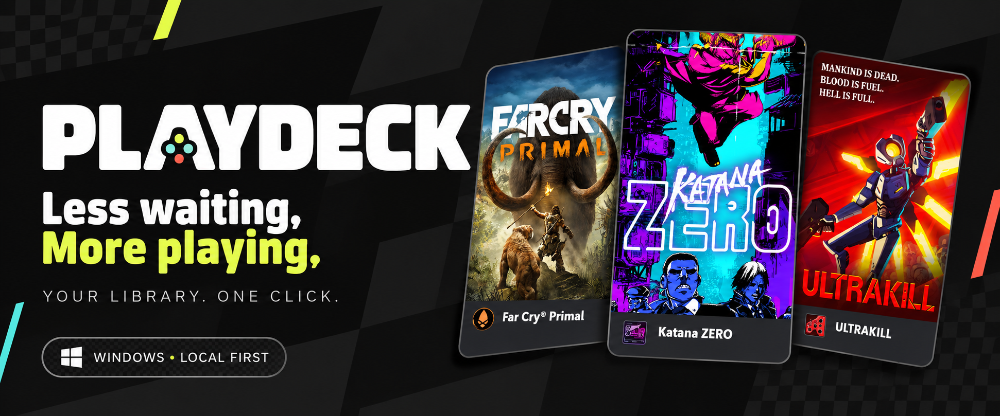
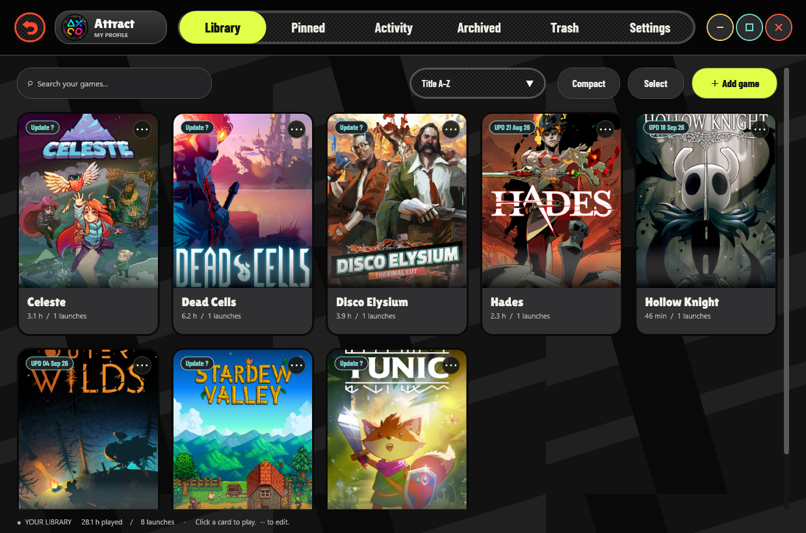
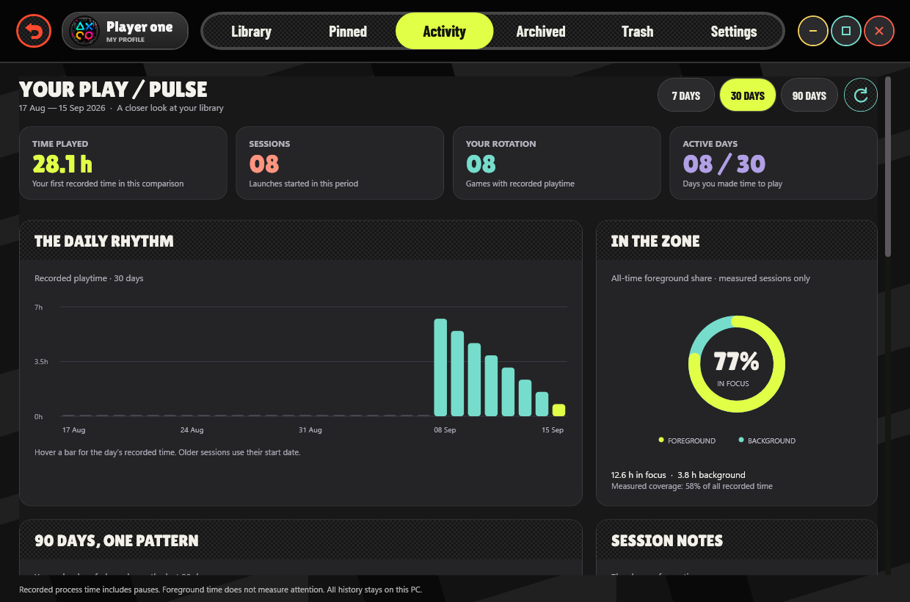
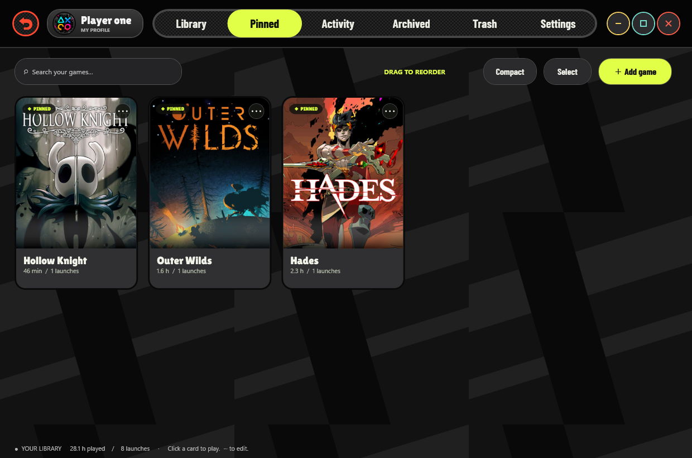
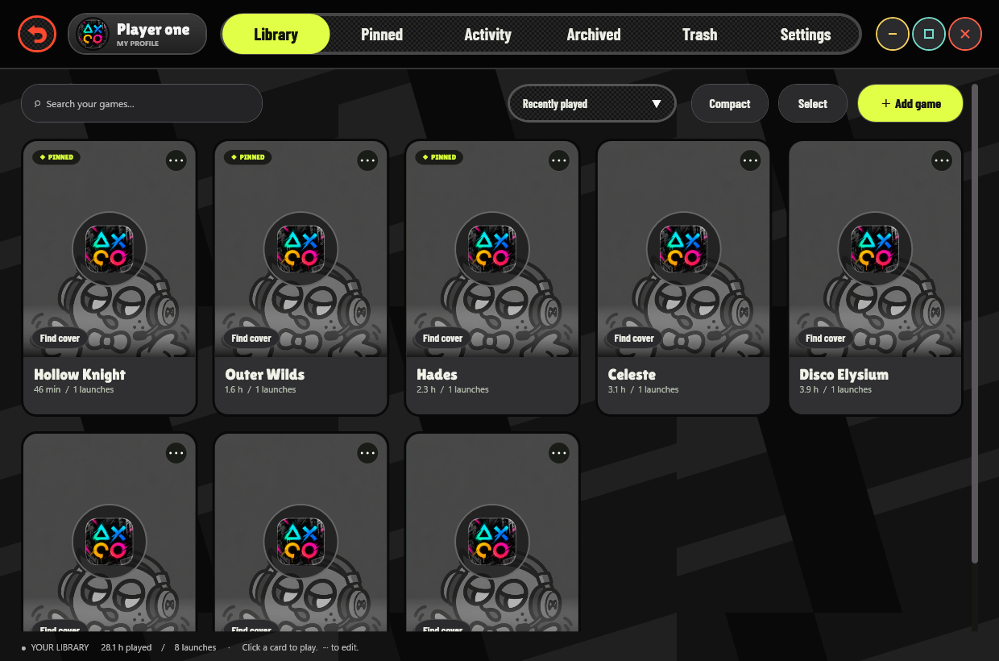
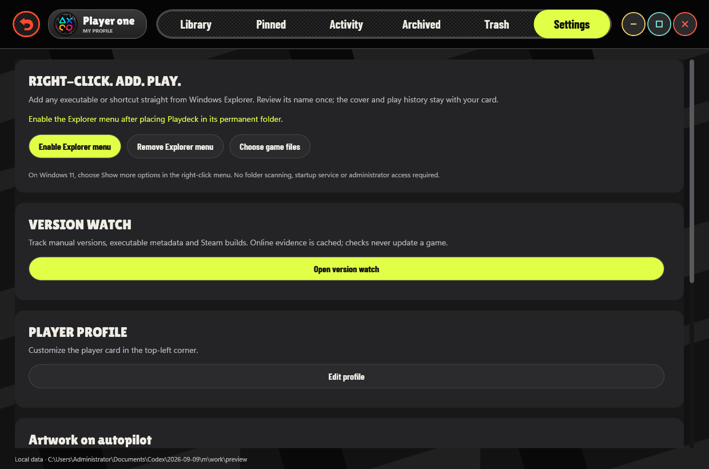
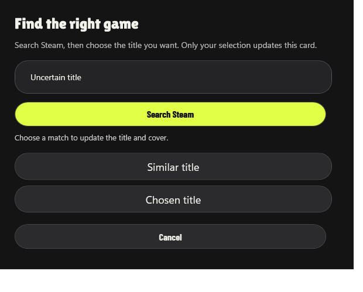
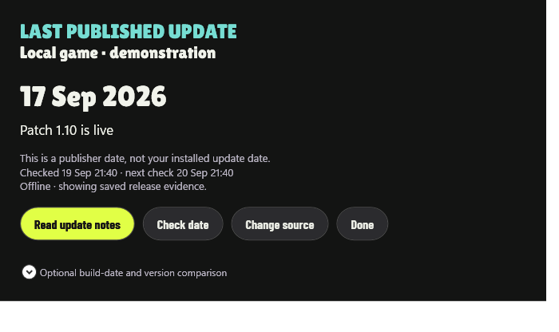
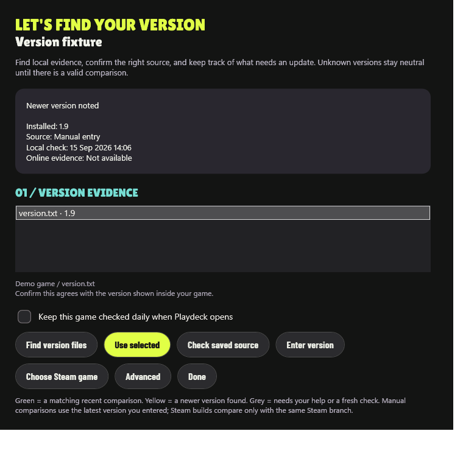

<p align="center"></p>

<p align="center">
<a href="https://github.com/DopaLab/playdeck/releases/latest"></a>


<a href="https://ko-fi.com/fgtranime"></a>
</p>

<h3 align="center">Your games deserve a better shelf.</h3>
<p align="center">A personal Windows launcher with bold cover cards, instant favorites and local play history.<br>No account. No folder crawler. No always-running launcher.</p>
<p align="center"><b><a href="https://github.com/DopaLab/playdeck/releases/latest/download/Playdeck-Setup-6.4.0.exe">↓ Install Playdeck</a> · <a href="https://github.com/DopaLab/playdeck/releases/latest/download/Playdeck-v6.4.0-win-x64.zip">Portable ZIP</a> · <a href="#your-library-in-motion">See the app</a></b></p>

## Your library, in motion



<table>
<tr><td width="50%"><b>01 / Make it yours</b><br>Right-click a game in Explorer → Add to Playdeck. Choose a Steam match for artwork, or paste your own cover. Your profile, your order, your library.</td><td width="50%"><b>02 / Get straight to the game</b><br>Click a card to launch. Use its three dots to edit. Pin favorites to a separate shelf and drag them into order. The launcher closes after a successful launch.</td></tr>
<tr><td><b>03 / Keep your story</b><br>Playtime, 7/30/90-day comparisons, a 90-day calendar, focus ring, game rankings and session history. New sessions distinguish foreground from background time and split across midnight.</td><td><b>04 / Keep it recoverable</b><br>Archive without losing cached art or history. Trash cards for seven days, restore mistakes, or empty the trash. Installed game files are never deleted.</td></tr>
</table>

<details open><summary><b>Activity & favorites — actual application captures</b></summary>

| Your play story | Your instant-play shelf |
|:--:|:--:|
|  |  |

</details>

<details><summary><b>Fallback artwork, settings & title matching</b></summary>



| Settings | Choose the right game |
|:--:|:--:|
|  |  |

</details>

The banner is AI-generated promotional art. Application images are real WPF captures with demonstration data; game artwork belongs to its respective owners.

## Built to do less work

- **Continuous, virtualized scrolling:** nearby cards are drawn on lightweight surfaces; overlapping rows survive updates and up to 72 nearby controls are reused (or more if needed for the visible viewport). Idle work prewarms adjacent rows.
- **Decoded artwork reuse:** frozen bitmaps in a bounded 48 MiB / 160-entry LRU cache. File changes invalidate entries. This is a cache budget, not a total RAM promise.
- **Indexed history:** cards look up their game's sessions instead of repeatedly scanning the entire history.
- **Quieter UI:** focus changes reload history only when the session directory changes; resizing coalesces expensive rebuilds.
- **No idle tracker:** a separate helper runs during a launched game, checkpoints every 30 seconds, and exits afterward. No boot service or scheduled task.
- **Cached metadata:** completed lookups and failures are remembered; manual Steam search results are cached for one day.

Historical v6.0 → v6.1 synthetic test (see the v6.2 follow-up in the performance document): 2,000 games, 20,000 sessions, eight preloaded covers, five refreshes and 100 scroll steps.

| WPF workload | v6.0 | v6.1 |
|---|---:|---:|
| Median library refresh | 130 ms | 40 ms |
| 95th-percentile scroll layout update | 23.6 ms | 12.3 ms |
| Managed allocation during workload | 29.8 MiB | 15.1 MiB |
| Repeated image decodes | 0 | 0 |
| Maximum realized cards | 25 | 25 |

Local synthetic layout measurements, **not GPU frame rates or universal guarantees**. Median scroll updates were 1.2 ms and 1.0 ms. Working-set snapshots were 147 and 151 MiB: this change reduces rendering work and allocation churn, not measured total RAM. See [method and raw results](docs/PERFORMANCE.md).

## Published update dates first

Cards now show compact **UPD** dates from publisher update posts. **REL** identifies the original release date when no update is known. Choose **Last updated / released** to sort the library; manually ordered pins stay in their own order.

In **Settings → Update Radar**, choose **Update date**, **Version**, or **Off**. Dates refresh at most once per 24 hours per source, including empty results and failures. Fetching dates does not scan executables or require an installed version number. Click a chip for the source post and notes. Publisher dates describe online announcements, not your local installation.

Build-date comparison is optional: confirm a valid `YYYY.MM.DD` label and the matching PC source. A later post gives a possible-update hint; dates never prove a copy is current. Version-number tools remain secondary.

**Settings → Playtime tracking** can disable observation entirely: the game starts directly, Playdeck closes, and no tracking helper is started. Existing statistics stay saved. The observer now excludes unrelated child processes outside the game's executable directory and runs below normal priority after launching the game. This does not establish or fix the cause of a reported commercial-game/system crash.



## Compare your local copy with published releases

Click the tiny version chip, press **V**, or open **Settings → Version Watch**.

**Enter your installed version → confirm the PC release source → Save & compare.** Playdeck independently fetches numbered publisher announcements, even for games installed outside Steam. Manual installed versions now work with online lookups. You can also confirm a local version file, or choose an official GitHub repository for games without a Steam page.

The dialog places **Your copy** beside **Published release**, with the announcement date, release-notes link, last check and next check. Changing the release source does not alter the card's title or artwork.

Small checkered chips stay compact: **yellow** for a confirmed newer numbered release, **green** for a recent match, **grey** when evidence needs review. A known update stays yellow when cached; an expired match loses green. A newer unnumbered patch prevents an older numbered release from claiming you are current.

Successful, empty and failed online results are cached for at least 24 hours. Daily checks include manually entered versions, resume when the launcher regains focus, and pause during tracked gaming. No resident version service.

This is evidence-based release tracking, not a universal update database. Publisher feeds can omit numbers or use different labels across editions. Those cases show what is missing and offer release notes or a manual latest-version note. [Sources, limits and real-library coverage](docs/VERSIONS.md).



## Install & play

1. Download the installer from [Releases](https://github.com/DopaLab/playdeck/releases/latest). Windows x64; the .NET runtime is included.
2. Install for your Windows account. Start menu and Explorer integration are included; the desktop shortcut is optional.
3. Right-click a game executable or shortcut → **Add to Playdeck**. On Windows 11, use **Show more options**. File picking and drag-and-drop also work.
4. Review the name, choose a cover match if needed, and click its card to play.

Uninstall through **Windows Settings → Apps**. Data in `%LOCALAPPDATA%\Playdeck` is intentionally retained, including during upgrades. The portable ZIP uses that same location. This is an **unsigned** community build; release hashes are supplied for integrity checking.

## A few useful details

| Action | How |
|---|---|
| Edit a card | Three dots in its upper corner |
| Paste a cover | Ctrl+V in the editor |
| Correct a title / find artwork | Find cover or Choose Steam match; select a result to apply it |
| Rearrange favorites | Drag cards in Pinned; other library sorts work independently |
| Remove junk cards | Select mode, or hold Delete while clicking a card |
| Start a fresh library | Settings; old cards move to recoverable trash |
| Export history | Settings → CSV, including focus time and session status |
| Customize profile | Click the player badge |
| Gaming utility / mod manager | Settings → Manage tools, or Mark as tool in its card editor |

### Tracking & privacy

**Tool mode** opens utilities independently, keeps Playdeck open and creates no play sessions. Existing tool history is retained but excluded from game analytics. Square opaque game icons receive rounded corners; transparent or shaped icons keep their outlines.

Only games launched **through Playdeck** are tracked. Process lifetime includes pauses; foreground time means the game owned the foreground window, not proof of active input. Sampling is every two seconds, so durations are approximate. Sleep gaps of ten seconds or more are excluded. Interrupted runs retain the last checkpoint, potentially losing about 30 seconds. Older sessions keep their original totals and use their start date in daily charts.

Exact executable identity and descendants help follow ordinary launcher handoffs. Very short bootstrap processes, elevated/protected games, anti-cheat and storefront reuse may require setting the actual tracking executable. Commercial-game compatibility is not universal. Launch-only and undetected sessions do not invent playtime.

Library, profile, artwork and history live locally. Metadata lookup contacts Steam services/CDNs; release checks send an AppID to Valve publisher news or a repository name to GitHub. Legacy Steam build checks use the third-party SteamCMD API. Online access can be disabled in settings. No telemetry, cloud account or library upload. Empty Trash removes card records; raw sessions, artwork and backups may remain. It is not secure erasure.

## Build it yourself

Requires Windows, [.NET 10 SDK](https://dotnet.microsoft.com/download/dotnet/10.0), and [Inno Setup 6.7+](https://jrsoftware.org/isinfo.php) for the installer.

```powershell
./build.ps1            # Self-contained portable build + regression tests
./build.ps1 -Installer # Also compile the installer
```

The UI and tracker publish separately. Only tracker-specific binaries are copied into the app directory, preserving WPF's WindowsBase runtime. See [validation](docs/VALIDATION.md), [changelog](CHANGELOG.md), [MIT code license](LICENSE) and [asset notices](THIRD_PARTY_NOTICES.md).

<p align="center"><b>Made for the moment you actually want to play.</b><br><a href="https://ko-fi.com/fgtranime">☕ Support development on Ko-fi</a> · <a href="https://github.com/DopaLab/playdeck/issues">Report a bug</a></p>
